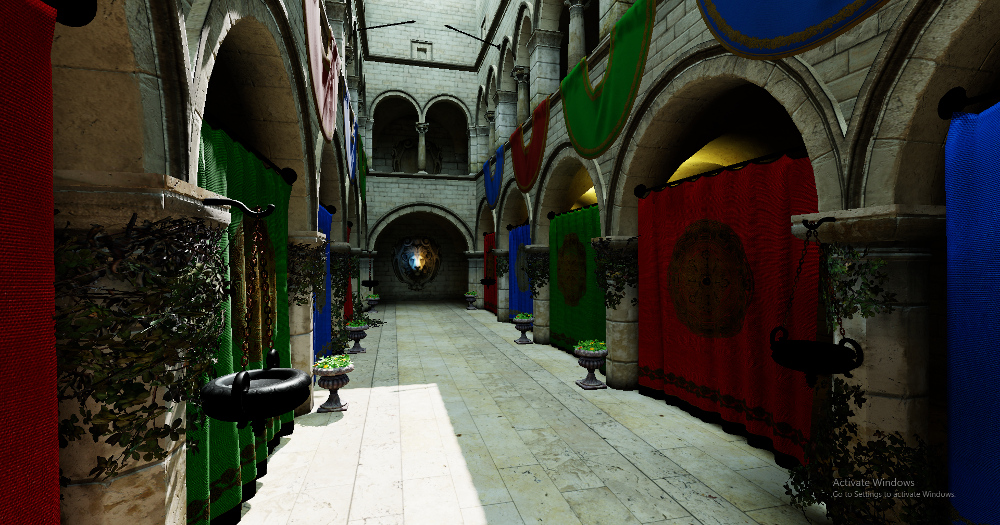
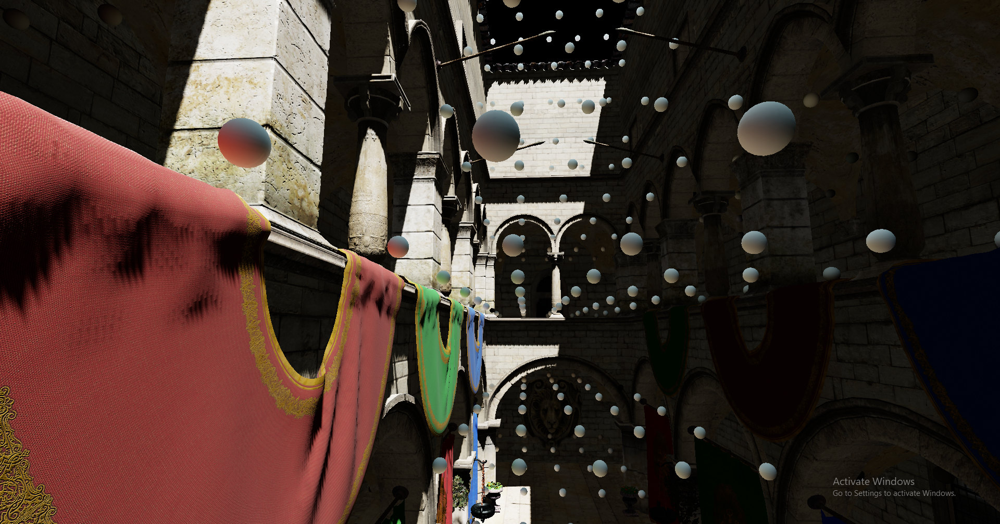
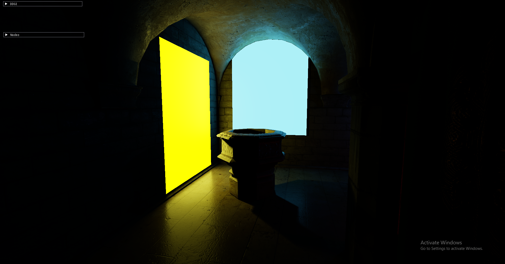
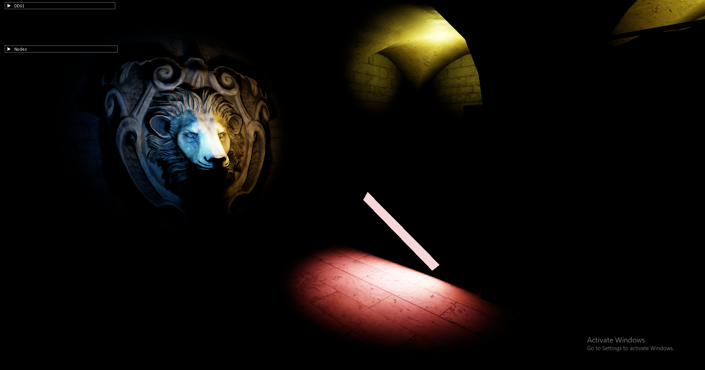
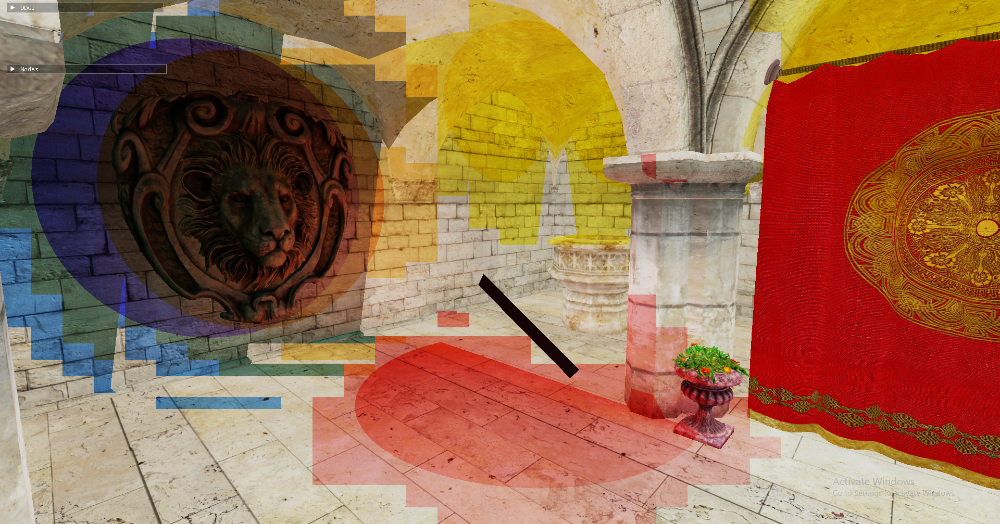

# DDGI

For more implentation details, refer to my [blog post](https://yaographicsdev.github.io/2026/08/12/ddgi-dev-journal.html).

 

# Lighting and Shadows

## Directional Light

## Point Lights

## Linearly Transformed Cosine Area Lights
Shadows approximated by point light PCSS with a large penumbrae. Still looks kind of too sharp.

## Light Clustering
Light clustering is done in view space. A quartic falloff is applied to lights to clamp influence radius. The first image shows the effect of direct lighting with GI disabled. The Second unlit view shows the clusters under the effect of individual lights (blocky light-colored regions) and actual influence radius (darker spherical or hemisphrical regions).

 

# Architectural and Miscellaneous

## Indirect Draw and Scene Culling
Mention render queue and corresponding pipelines

## Shader Uniform Reflection
