# DDGI
A basic implementation based on the 2019 DDGI paper (citations needed). Accounts for only the diffuse components.
## Ray-Queried Light Visibility
By leveraging Vulkan's acceleration structures and ray query shader functions, I am able to get a clean representation of light visibility from any point in the scene. Illustrated is an image generated by querying rays originate from camera and shoot out in the direction of every individual screen pixel. Only Lambertian diffuse BRDF of direct lighting is accounted for. This is often enough for indirect lighting unless you're aiming for sharp acoustics reflected off of metallic surfaces. Notice the pixel-perfect shadows, a signature visual cue of ray query. Also notice the heavy moire pattern caused by a lack of mipmapping. Since I will be averaging out radiance later down the line, these artifacts won't matter.

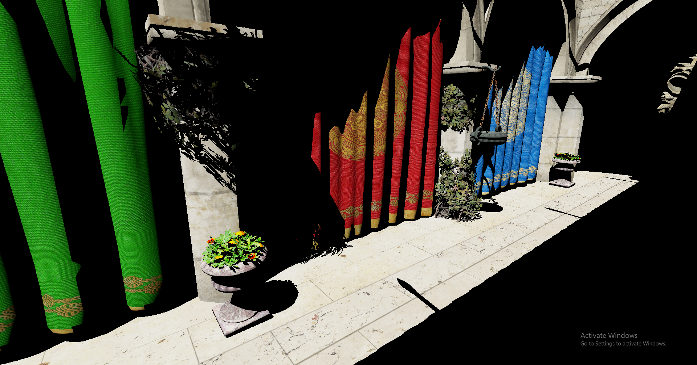

By changing ray origin from camera to each probe's location and screen pixels to spherical surface samples, sampling radiance from probes at arbitrary points in space can be done with the same query architecture. In this example I placed 16x8x16 probes across the Sponza scene and traced 192 rays out of each probe. The four textures of hit points' positions, normals, albedo and metallic-roughness of one round of tracing are listed below.

  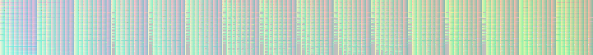 
  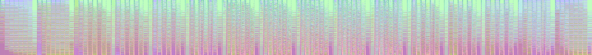 
  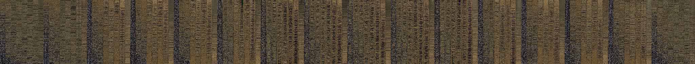 
  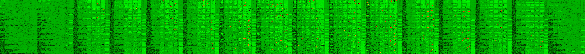 

## Probe Placement in Blender
A proper editor is out of the scope of my current work. So I took it to Blender to author probe fields for my renderer. Since DDGI inherently guarantees no light leaking regardless of probe placements, I just needed to create an axis aligned probe field and export the corner position with constant spacing between neighboring probes. This is done by running a small script inside Blender.

  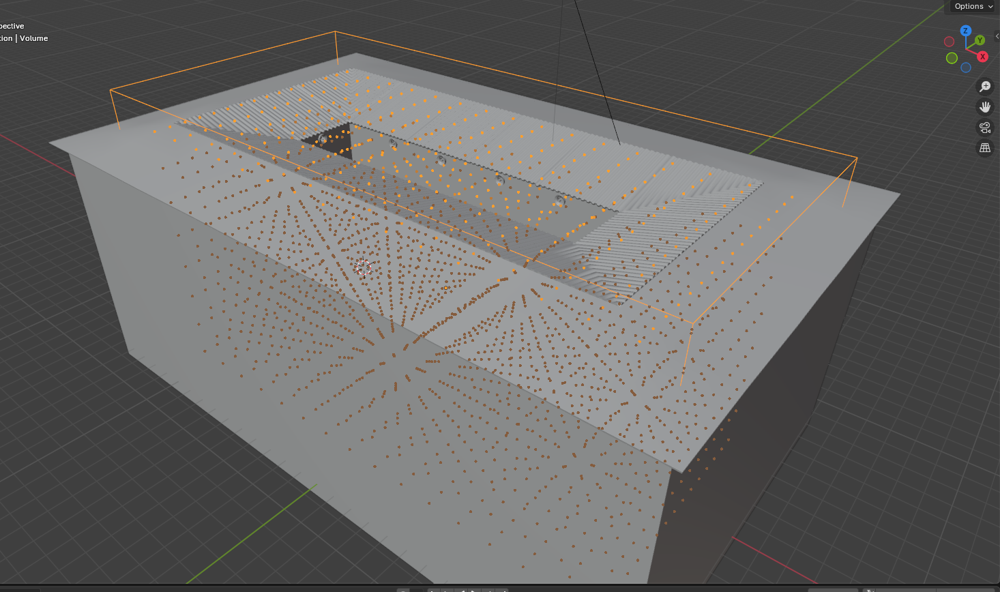
  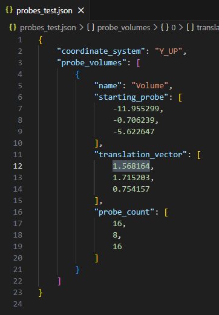

## Probe Data Atlas
The original DDGI paper divides probe update into multiple substeps including depth filtering, actual probe data update and copying edges. Since Vulkan is so versatile, my probe update is done in a single compute pass with in-shader barriers to synchronize probe data and edge data writes.

### Irradiance
Should be more rigorously called the cosine-weighted average radiance. Borders added to each probe to accommodate linear sampling across octahedral encoding's seams. Layers of probes from ground level all the way to the roof.

    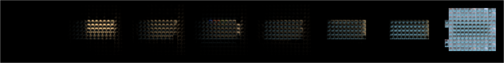

### Depth
Encodes weighted average of occluder distance and weighted average of squared occluder distance in R and G channels respectively. That is the reason why the atlas appears to be yellow. Darker regions indicate the presence of occluders. 

    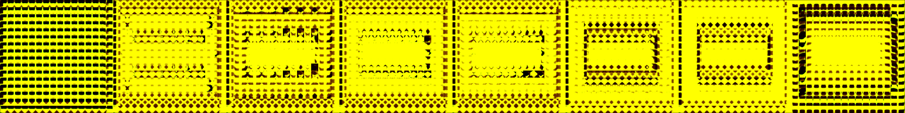

## Irradiance Probes Debug Draw

    

## Depth Probes Debug Draw

    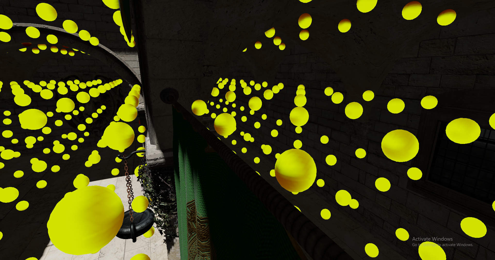

## Temporal Denoising
Without temporal denoising, probes in well-lit regions encode surrounding scenes resonably well. But those in darker regions who only have a glimpse of light captures wildly unreliable lighting. Image below illustrates this problem. Notice the way bright and dim probes appearing alternatively in the corner.

    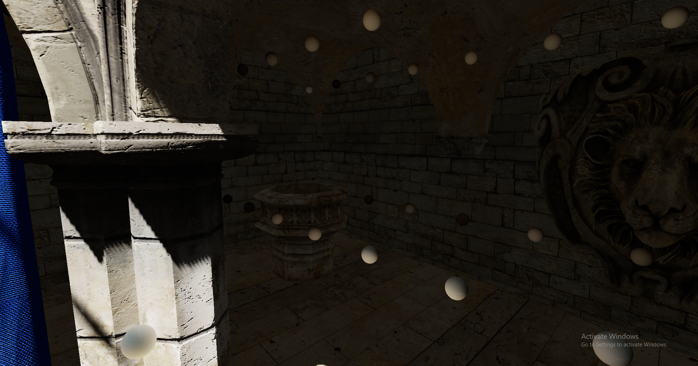

Below shows the small patch of light that probes tucked away in the same corner could see. This would appear to be a spike if you plot out the radiance distribution across this probe's spherical surface. Discrete samples on a spherical surface, in this case generated by a spherical fibonacci sequence, sometimes miss high frequency spatial distributions. 

    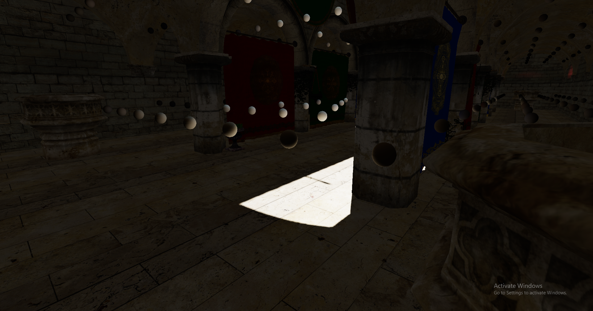

 Drastically increasing sample count (to 1024 or even 2048) per probe per frame could mitigate this effect but that completely tanks the performance. Rotate the fibonacci sequence every frame, then blend this frame's atlas into last frame's. That way samples are distributed across multiple frames, keeping work per frame low. This is how temporal denoising work in probe update. Temporal denoising requires fine tuning. The blend weight of history atlas is referred to as 'hysteresis' by the authors. If hysteresis is too high, probes become less responsive to changes in the scene, creating a 'lingering' effect. If the value is set too low, flickering becomes more pronounced. 
 
 This method prompted me to add history resource support to my frame graph implementation. See otcv repository for details. After temporal denoising:

 

    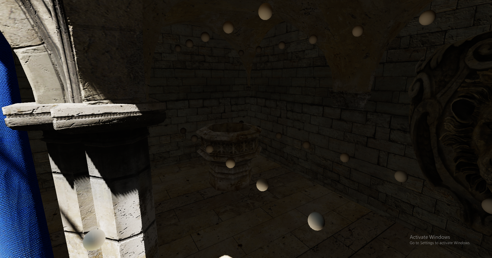

 
Good. No more alternating dim and bright probes.

The same idea also occured in rigidbody collision resolution, where they coined the term "sequential impulse" to describe the algorithm that distributes collision resolution iterations across multiple frames instead of going through all of them in one frame.

## Multi-Bounce
At first I thought a single-bounce indirect lighting is visually convincing enough. But when I was thinking about adding skylight to the Sponza scene, I found out that skylight cannot affect regions that do not have direct line of sight of the sky. Only through multiple bounces can skylight find its way into every corner of the entire scene. Multi-bounce is easily achieved by adding a probe sampling pass and additively blend the result into the result of exsiting direct lighting query pass. By doing that, I can basically recreate the scene demonstrated by DDGI authors where they lit an entire bathroom with skylight only. (reference needed) Below is a comparison between the effect of single-bounce and multi-bounce. In either case, there is no direct lighting in the scene. The backside of the curtain is supposed to be lit up by light bounced off of surfaces out in the atrium on the other side of the curtain.

  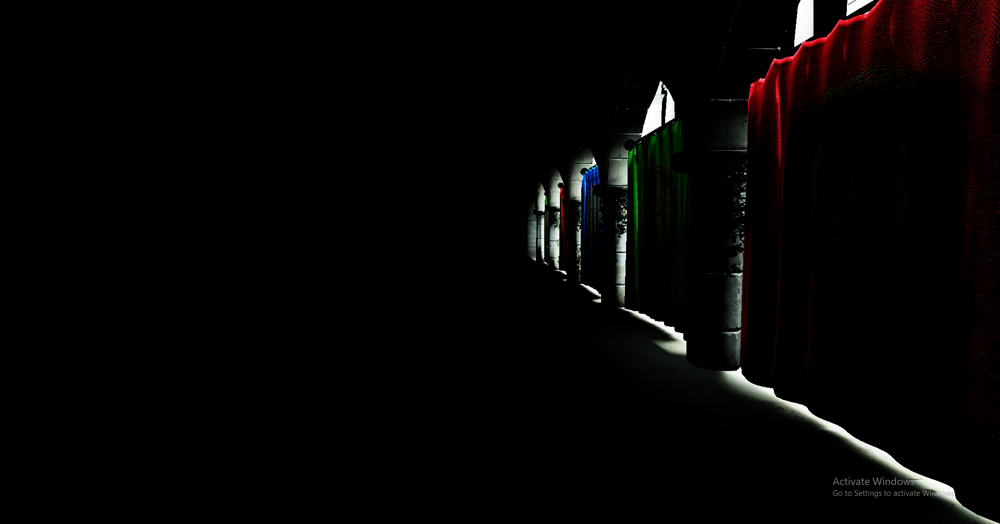 
  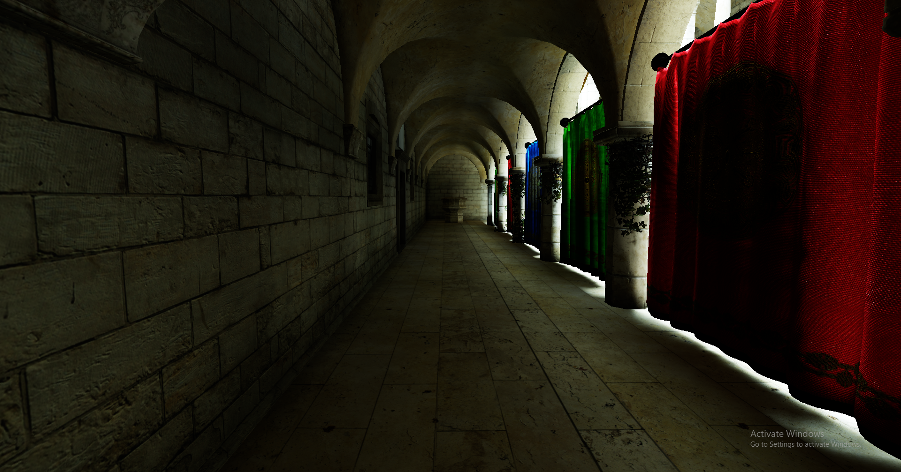

## Putting It All Together
TODO

## Caveats and Possible Improvements
1. Reflective probes
2. Light culling and clustering problem. Every ray query needs to know which light affects the point where the ray hits. My existing light culling and clustering system only works in view space. Since probes are scattered across the entire scene, there is no universal view space for all of the probes. So I iterated through all lights. That is going to tank performance if light count gets really high. Consider world space light culling. Create a scene-wide grid and rasterize light influence sphere within this grid. Both view space light clustering and ray query light clustering could be incorporated into this architecture.
3. Probe update frequence. Probes far away from camera or placed near static objects could update at a much lower rate.
4. area light or emissive material
5. 

# Shadow Mapping

## Cascaded Shadow Maps

## Cube Shadow Maps

## PCSS and Area Light Shadow Approximation

# Linearly Transformed Cosine Area Lights

# Light Clustering

# Architectural and Miscellaneous

## Indirect Draw and Scene Culling
Mention render queue and corresponding pipelines

## Shader Uniform Reflection

